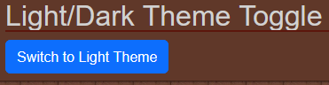
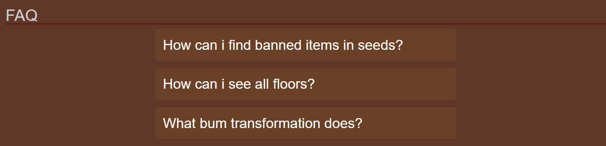
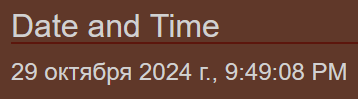
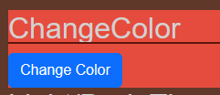
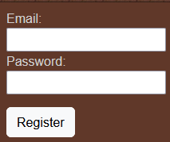
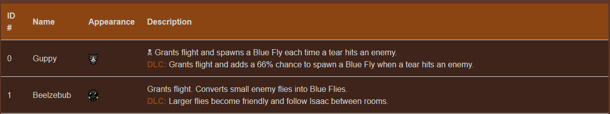
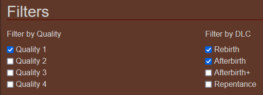
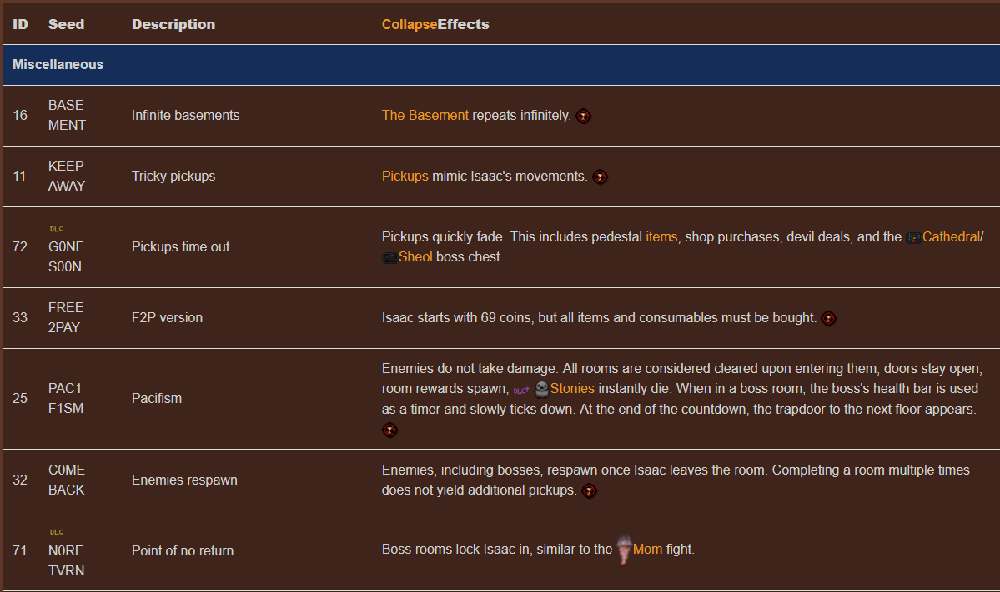
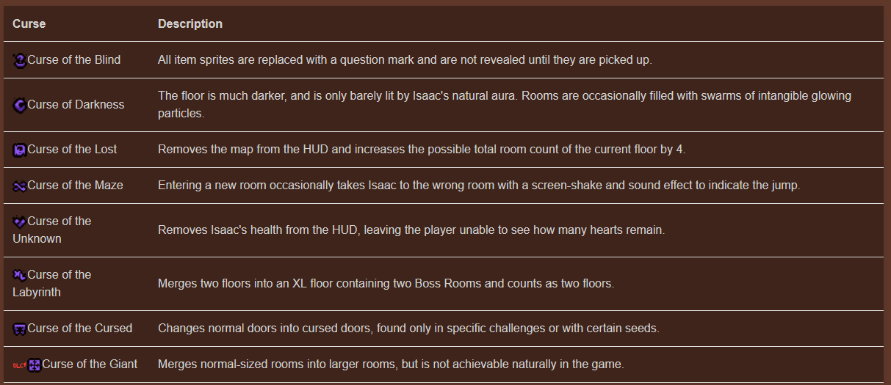
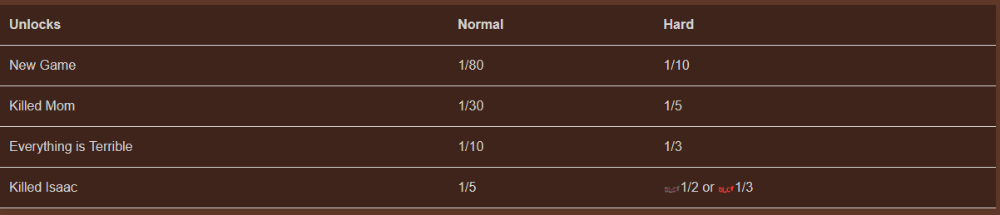

# The Binding of Isaac: Rebirth Wiki

Welcome to **The Binding of Isaac: Rebirth Wiki** project! This wiki aims to provide comprehensive information about the game, its characters, items, transformations, and more. Below is a brief overview of the pages included in this project:

## Pages Overview

### 1. Home Page (`index.html`)
- **Description:** The main entry point of the wiki, featuring navigation links to other sections and a brief introduction to the game.
- **Key Features:**
  - Light/Dark Mode <br> 
  - FAQ <br> 
  - Date and Time <br> 
  - Random background color changer <br>
  - Some pages don't work, so modal would be shown instead of broken link

### 2. Register Page (`register.html`)
- **Description:** A user registration page where users can create an account to access additional features of the wiki.
- **Key Features:**
  - Email and password input fields.
  - A button to initiate the registration process.
<br>

### 3. Login Page (`login.html`)
- **Description:** A user authentication page where users log into their accounts
- **Key Feature:** 
  - Simple email and password check
  - Simple authentication
<br> 

### 4. Transformations Page (`transformations.html`)
- **Description:** This page provides detailed information about various transformations available in the game.
- **Key Features:**
  - A table listing transformations, including their ID, name, appearance, and description. <br>
  - Sections for requirements and trivia related to transformations.

### 5. Items Page (`items.html`)
- **Description:** A comprehensive list of items available in the game.
- **Key Features:**
  - Filters allowing to see only needed items <br> 
  - Filters saves between pages
  - A table detailing each item's name, effects, and appearances. <br> 

### 6. Characters Page (`chapters.html`)
- **Description:** Information about the chapters in the game and their floors
- **Key Features:**
  - Each chapters floor shown
  - Optional and Alternative chapters and their floors shown
<br> 

### 7. Seeds Page (`Seeds.html`)
- **Description:** Information about each seed available in a game
- **Key Features:**
  - Shows in what dlc that seed was added
  - Shows when achievements are disabled
  - Provides good description of Effects
<br> 

### 8. Endings page (`endings.html`)
- **Description:** Information about each ending shown
- **Key Features:**
  - Image Carousel: Shows images from each ending <br>

### 9. Curses page (`Curses.html`)
- **Description:** Information about each Curse available in a game
- **Key Features:**
  - Shows description about each curse <br> 
  - Shows chance of getting a curse <br> 
  - Gives trivia about curses <br> 

## Usage

To view the pages, open `index.html` in a web browser. You can navigate through the wiki using the links provided on each page.

## Installation

Clone this repository to your local machine:

```bash
git clone <repository-url>
```

## Authors

- Maxim Kolodin
- Alimzhan Zhaparov
- Askar Toraliyev

We hope you enjoy using the wiki!